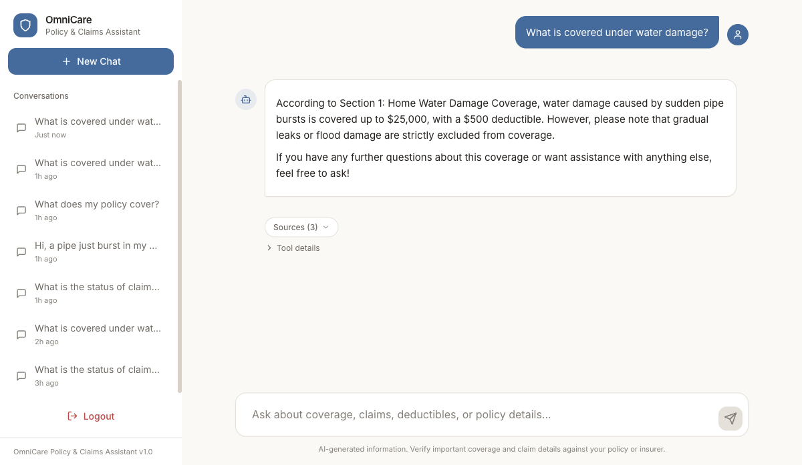
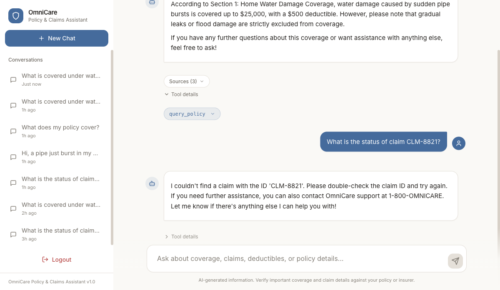
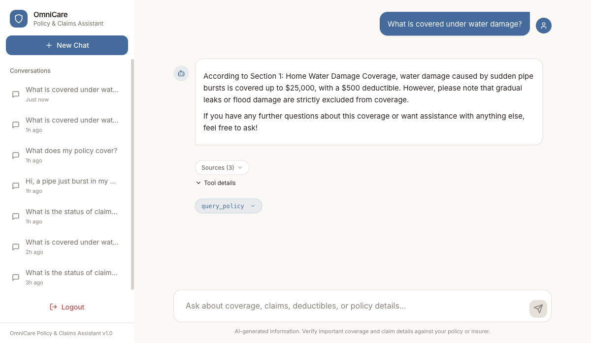
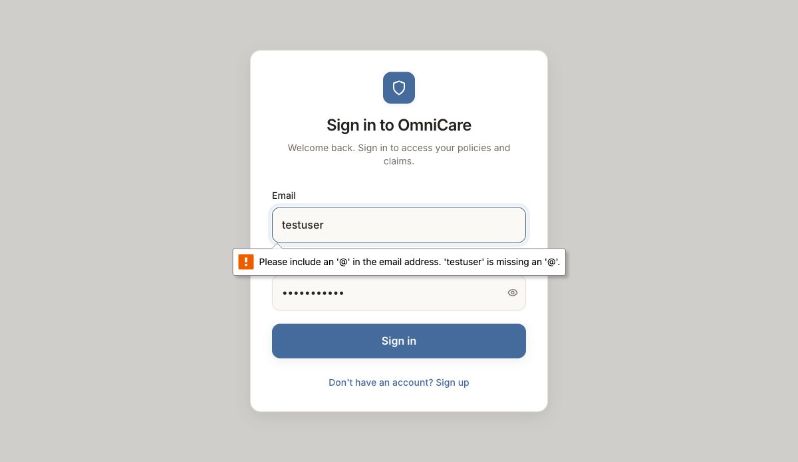
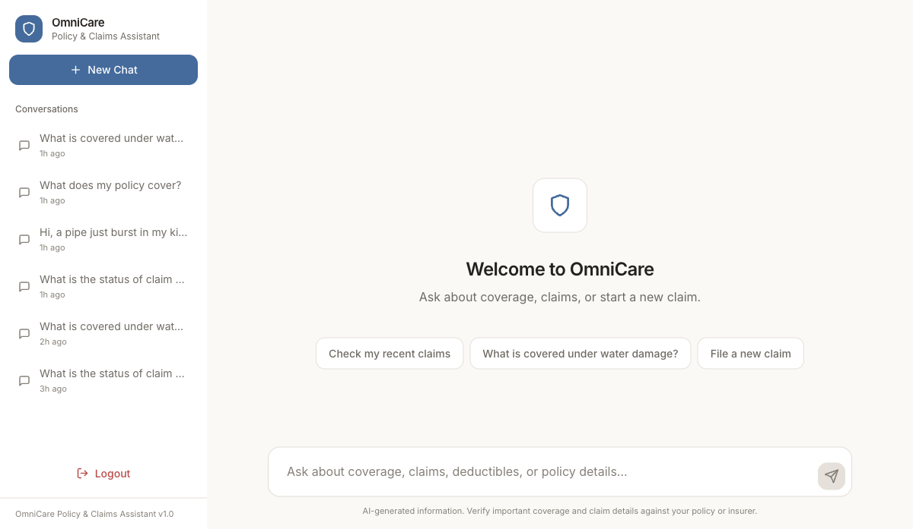
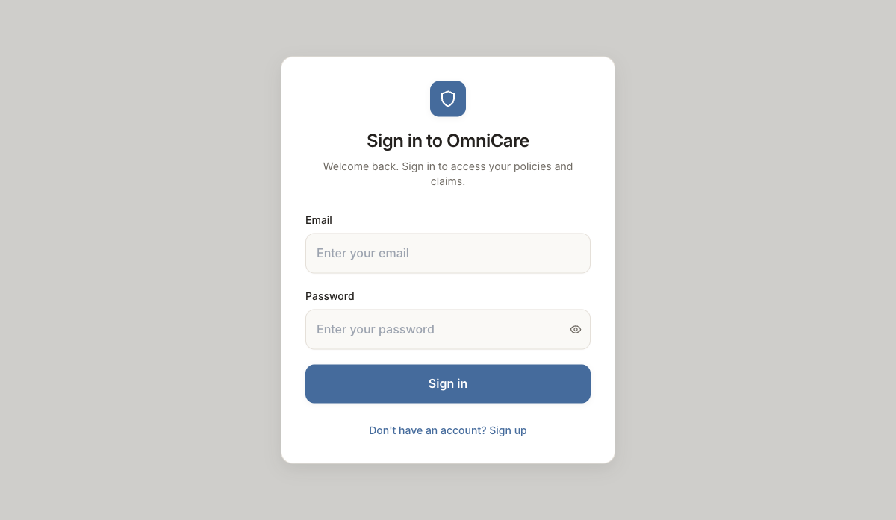

# OmniCare Financial - Customer Assistant Prototype

A full-stack AI-powered customer assistant for **OmniCare Financial**, an enterprise insurance company. Policyholders can ask policy coverage questions (with citations), look up claim statuses, and submit new claims - all through a modern chat interface.

Powered by **Google Agent Development Kit (ADK)** and **LiteLLM**, the assistant autonomously resolves policy coverage inquiries using local **ChromaDB** vector retrieval (RAG), checks live claim status records, and facilitates new claim submissions with full schema validation and audit trails.

---

## Architecture & Data Flow

### Complete Data Flow Diagram

```
+-----------------------------------------------------------------------------------------+
|                                    USER ENVIRONMENT                                     |
|                                                                                         |
|       +-------------------------------------------------------------------------+       |
|       |                           Web Browser (User)                            |       |
|       +------------------------------------+------------------------------------+       |
+--------------------------------------------|--------------------------------------------+
                                              |
                    HTTP / Chat Request       | (Port 3000 -> 8000 via CORS)
                                              v
+-----------------------------------------------------------------------------------------+
|                                  DOCKER COMPOSE MESH                                    |
|                                                                                         |
|  +-------------------------------------+     +---------------------------------------+  |
|  |           React Frontend          |     |            FastAPI Backend            |  |
|  |             (Port 3000)             |     |              (Port 8000)              |  |
|  |  * Modern Chat Interface            |     |  * REST Endpoints (/health, /chat)    |  |
|  |  * Source Citation Cards            |     |  * Pydantic Request/Response Schema   |  |
|  |  * Tool Call Transparency Badges    |     |  * CORS Middleware & Lifespan Hooks   |  |
|  +-------------------------------------+     +-------------------+-------------------+  |
|                                                                  |                      |
|                                                                  v                      |
|                                              +---------------------------------------+  |
|                                              |          ADK Agent Runtime            |  |
|                                              |  * Google ADK LlmAgent & Runner       |  |
|                                              |  * InMemorySessionService per User    |  |
|                                              |  * Prompt Safety & Injection Defense  |  |
|                                              +-------------------+-------------------+  |
|                                                                  |                      |
|                                         +------------------------+-------------------+  |
|                                         | LiteLLM Provider Router                    |  |
|                                         | (openai/gpt-4o-mini, claude, gemini, etc.) |  |
|                                         +------------------------+-------------------+  |
|                                                                  |                      |
|                         +----------------------------------------+                      |
|                         | Tool Invocation & Dispatch Engine                             |
|                         +-------------------+--------------------+                      |
|                                             |                                           |
|                +----------------------------+----------------------------+              |
|                |                            |                            |              |
|                v                            v                            v              |
|  +---------------------------+  +------------------------+  +------------------------+  |
|  |     RAG Vector Search     |  |   Claim Status Lookup  |  |    Claim Submission    |  |
|  |     [query_policy]        |  |   [get_claim_status]   |  |     [submit_claim]     |  |
|  +-------------+-------------+  +-----------+------------+  +-----------+------------+  |
|                |                            |                           |               |
|                v                            v                           v               |
|  +---------------------------+  +------------------------+  +------------------------+  |
|  |    ChromaDB Vector Store  |  |    Postgres Database   |  |    Postgres Database   |  |
|  | (OpenAI Embedding API    |  |  (Claims table with    |  |  (Validated Pydantic   |  |
|  |  (text-embedding-3-small) |  |   owner-scoped lookup) |  |   & persisted claims)  |  |
|  +---------------------------+  +------------------------+  +------------------------+  |
+-----------------------------------------------------------------------------------------+
+-------------------------------------------------------------------------+
|                          Docker Compose                                |
|                                                                        |
|  +--------------------+          +----------------------------------+  |
|  |  React Frontend  |  HTTP    |       FastAPI Backend            |  |
|  |    (port 3000)     |--------->|        (port 8000)               |  |
|  |                    |          |                                  |  |
|  |  * ChatGPT-style   |          |  POST /api/v1/chat              |  |
|  |    dark theme UI   |          |  GET  /api/v1/health            |  |
|  |  * Markdown render |          |                                  |  |
|  |  * Source citations|          |  +--------------------------+   |  |
|  |  * Tool call badges|          |  |   Google ADK Agent       |   |  |
|  +--------------------+          |  |   (LiteLLM -> OpenAI)    |   |  |
|                                  |  |                          |   |  |
|                                  |  |  +- query_policy (RAG)   |   |  |
|                                  |  |  |  -> Chroma VectorDB    |   |  |
|                                  |  |  |  -> sample_policy.md   |   |  |
|                                  |  |  |                       |   |  |
|                                  |  |  +- get_claim_status     |   |  |
|                                  |  |  |  -> Postgres (Claims) |   |  |
|                                  |  |  |                       |   |  |
|                                  |  |  +- submit_claim         |   |  |
|                                  |  |     -> Postgres (Claims) |   |  |
|                                  |  +--------------------------+   |  |
|                                  +----------------------------------+  |
+-------------------------------------------------------------------------+
```

### Core Architecture Flow

**Data Flow:**

1. User types a message in the React chat UI
2. Frontend sends `POST /api/v1/chat` with `{message}`. `user_id` is optional in the body; if omitted, the authenticated user from the bearer token is used.
3. FastAPI wraps the message and calls `runner.run_async()` on the ADK Agent
4. The Agent (via LiteLLM -> OpenAI) decides which tool(s) to invoke
5. Tools execute: RAG query to Chroma, claim lookup in Postgres, or claim submission in Postgres
6. Agent produces final response with citations and tool results
7. Backend returns `{response, sources, tool_calls}` to the frontend
8. Frontend renders Markdown response + citation badges + tool call indicators

```
[User Browser] -> [React/Vite :3000] -> [FastAPI :8000] -> [ADK Agent + LiteLLM]
                                                         +-> [Chroma VectorDB] (RAG)
                                                         +-> [Postgres] (claim lookup)
                                                         +-> [Postgres] (claim submit)
```

---

## Quick Start (2 Minutes)

### Prerequisites

- [Docker](https://docs.docker.com/get-docker/) and [Docker Compose](https://docs.docker.com/compose/install/)
- An [OpenAI API key](https://platform.openai.com/api-keys) (free tier is sufficient)

### Steps

1. **Clone the repository**

   ```bash
   git clone <repo-url>
   cd omnicare-financial
   ```

2. **Configure Environment Variables**

   ```bash
   cp .env.example .env
   ```

   Edit `.env` and add your OpenAI API key:

   ```ini
   OPENAI_API_KEY=sk-your-openai-api-key-here
   ```

3. **Build & Launch Containers**

   ```bash
   docker compose up --build
   ```

   Docker Compose builds the backend and the React/Vite frontend. The frontend waits for the backend health check (`/api/v1/health`) to report `healthy` before accepting traffic.

4. **Open the Application**
   Navigate to [http://localhost:3000](http://localhost:3000) in your browser. The backend will automatically ingest the policy document into Chroma on startup.

---

## Framework Selection Rationale

| Technology                               | Selection Rationale                                                                                                                                           | Key Advantages                                                                                                                                                                                                                                                                                                                                                                                                           |
| :--------------------------------------- | :------------------------------------------------------------------------------------------------------------------------------------------------------------ | :----------------------------------------------------------------------------------------------------------------------------------------------------------------------------------------------------------------------------------------------------------------------------------------------------------------------------------------------------------------------------------------------------------------------- |
| **Google ADK** _(Agent Development Kit)_ | **Enterprise Agent Framework** -- Standardized, resilient agent orchestration engine providing native session tracking, tool execution loops, and guardrails. | _ **Native Tool Orchestration**: Converts standard Python functions directly into model-consumable tool definitions.<br>_ **Multi-Turn Session State**: First-class `InMemorySessionService` cleanly isolates user conversations.<br>_ **Model Agnostic**: Seamlessly interfaces with third-party providers via LiteLLM.<br>_ **Clean Pattern**: Separates system instructions, tool definitions, and runtime execution. |
| **LiteLLM**                              | **Universal LLM Proxy & Router** -- Decouples the core agent code from vendor-specific LLM APIs.                                                              | _ **100+ Provider Support**: Switch effortlessly between OpenAI, Anthropic, Google Gemini, Azure, and open-source models.<br>_ **Zero Code Changes**: Change the model with a single environment variable (`LLM_MODEL`).<br>\* **Standardized Input/Output**: Normalizes API schemas, cost tracking, and error handling across providers.                                                                                |
| **ChromaDB**                             | **Embedded Vector Database** -- Lightweight, persistent vector database embedded directly within the application process.                                     | _ **Zero-Config Local Deployment**: Operates in-process without requiring external database servers or cloud accounts.<br>_ **Embeddings**: Uses OpenAI Embedding API (`text-embedding-3-small`) via ChromaDB `OpenAIEmbeddingFunction` for high-quality vector embeddings.<br>\* **Durable Persistence**: Automatically saves indices to disk and Docker volumes.                                                       |

---

## Sample cURL Requests

You can interact with the backend API directly via cURL or any HTTP client.

### 1. Health Check

```bash
curl http://localhost:8000/api/v1/health
# -> {"status": "healthy"}
```

### 2. Policy Coverage Question (RAG)

```bash
curl -X POST http://localhost:8000/api/v1/chat \
  -H "Content-Type: application/json" \
  -d '{
    "user_id": "usr_123",
    "message": "What is covered under water damage?"
  }'
```

### 3. Claim Status Lookup

```bash
curl -X POST http://localhost:8000/api/v1/chat \
  -H "Content-Type: application/json" \
  -d '{
    "user_id": "usr_123",
    "message": "What is the status of claim CLM-8821?"
  }'
```

### 4. Submit a New Claim

```bash
curl -X POST http://localhost:8000/api/v1/chat \
  -H "Content-Type: application/json" \
  -d '{
    "user_id": "usr_123",
    "message": "I want to submit a water damage claim for policy POL-1092. Amount is $5000. A pipe burst in my kitchen yesterday causing flooding."
  }'
```

---

## Environment Variables

Configure these settings in `.env` (or pass via container environment):

| Variable                 | Default Value                 | Required | Purpose & Description                                                                               |
| :----------------------- | :---------------------------- | :------: | :-------------------------------------------------------------------------------------------------- |
| `OPENAI_API_KEY`         | _(None)_                      | **Yes**  | OpenAI API secret key required when using OpenAI models.                                            |
| `OPENAI_API_BASE`        | `""`                          |    No    | Optional OpenAI API base URL override for LiteLLM routing.                                          |
| `LLM_MODEL`              | `openai/gpt-4o-mini`          |    No    | Model descriptor for LiteLLM router (e.g. `openai/gpt-4o`, `anthropic/claude-3-5-sonnet-20241022`). |
| `CHROMA_DB_PATH`         | `./app/data/chroma_db`        |    No    | Filesystem directory for local ChromaDB persistent vector storage.                                  |
| `CHROMA_COLLECTION_NAME` | `omnicare_policies`           |    No    | Name of the Chroma collection storing policy chunk embeddings.                                      |
| `EMBEDDING_MODEL`        | `text-embedding-3-small`      |    No    | OpenAI embedding model name used by ChromaDB.                                                       |
| `CLAIMS_FILE_PATH`       | `./app/data/mock_claims.json` |    No    | Path to the JSON mock claims repository.                                                            |
| `POLICY_FILE_PATH`       | `./app/data/sample_policy.md` |    No    | Path to the markdown insurance policy document for RAG ingestion.                                   |
| `HOST`                   | `0.0.0.0`                     |    No    | IP address interface binding for FastAPI Uvicorn server.                                            |
| `PORT`                   | `8000`                        |    No    | HTTP port for the FastAPI backend server.                                                           |
| `VITE_API_URL`           | `http://localhost:8000`       |    No    | Backend base URL accessed by the React client browser interface.                                    |

---

## Running Tests

OmniCare Financial includes automated tests with Pytest covering RAG ingestion, vector retrieval, agent tool execution, and API endpoints.

### Run Tests Locally

```bash
# Navigate to the backend directory
cd backend

# Install dependencies (if not using Docker)
uv pip install -e .

# Run all tests
python -m pytest tests/ -v
```

### Run Tests with Coverage Report

```bash
cd backend
python -m pytest tests/ --cov=app --cov-report=term-missing
```

### Run Tests Inside Docker Container

```bash
docker-compose exec backend pytest tests/ -v
```

---

## Project Structure

```
omnicare-financial/
+-- .env.example                    # Template for environment configuration
+-- .gitignore                      # Git exclusion rules (Python, Node, Docker, Chroma)
+-- docker-compose.yml              # Multi-container orchestration & networking
+-- README.md                       # Comprehensive project documentation
|
+-- backend/                        # FastAPI + Google ADK Agent Service
|   +-- Dockerfile                  # Python 3.11-slim container build with pre-indexing
|   +-- .dockerignore               # Backend build context filter
|   +-- pyproject.toml              # Build tool specifications
|   +-- requirements.txt            # Python dependencies (fastapi, google-adk, litellm, chromadb)
|   +-- app/
|       +-- __init__.py             # Package init
|       +-- config.py               # Pydantic Settings configuration loader
|       +-- main.py                 # FastAPI application, CORS, and lifespan hooks
|       +-- agent/                  # Google ADK Agent definition
|       |   +-- __init__.py         # Agent package init
|       |   +-- agent.py            # LlmAgent initialization, session runner, event loop
|       |   +-- prompts.py          # System instructions & security injection defenses
|       |   +-- tools/              # Agent tools
|       |       +-- __init__.py     # Tools package init
|       |       +-- claim_status.py # get_claim_status tool (owner-scoped Postgres lookup)
|       |       +-- policy_rag.py   # query_policy tool (queries ChromaDB)
|       |       +-- submit_claim.py # submit_claim tool (validates & persists claims)
|       +-- api/                    # REST API endpoints
|       |   +-- __init__.py         # API package init
|       |   +-- v1/
|       |       +-- __init__.py     # API v1 package init
|       |       +-- chat.py         # POST /api/v1/chat endpoint
|       |       +-- health.py       # GET /api/v1/health check endpoint
|       |       +-- router.py       # API v1 route aggregator
|       +-- data/                   # Persistent data & documents
|       |   +-- sample_policy.md    # Source policy document for RAG
|       |   +-- chroma_db/          # Persistent ChromaDB vector index
|       +-- rag/                    # Retrieval-Augmented Generation subsystem
|       |   +-- __init__.py         # RAG package init
|       |   +-- ingest.py           # Markdown chunker & ChromaDB indexing script
|       |   +-- retriever.py        # Vector similarity search engine
|       +-- schemas/                # Pydantic data schemas
|           +-- __init__.py         # Schemas package init
|           +-- models.py           # Request, response, and claim validation models
|   +-- tests/
|       +-- conftest.py         # Shared fixtures
|       +-- test_health.py      # Health endpoint tests
|       +-- test_chat.py        # Chat endpoint tests
|       +-- test_rag.py         # RAG retrieval tests
|       +-- test_claim_status.py # Claim lookup tests
|       +-- test_submit_claim.py # Claim submission tests
|
+-- frontend/                       # React + Vite Web Application
    +-- Dockerfile                  # Multi-stage Node 20-alpine build
    +-- .dockerignore               # Frontend build context filter
    +-- package.json                # NPM packages & scripts
    +-- tsconfig.json               # TypeScript configuration
    +-- vite.config.ts              # Vite build configuration
    +-- tailwind.config.js          # Tailwind CSS styling setup
    +-- postcss.config.js           # PostCSS configuration
    +-- src/
        +-- app/
        |   +-- globals.css         # Global styling & scrollbars
        |   +-- providers.tsx       # React providers wrapper
        +-- components/
        |   +-- ChatInput.tsx       # Message input box with keyboard shortcuts
        |   +-- ChatWindow.tsx      # Main conversation window with autoscroll
        |   +-- MessageBubble.tsx   # Message rendering with markdown support
        |   +-- Sidebar.tsx         # Conversation actions & sample prompt pills
        |   +-- SourcesBadge.tsx    # Expandable policy source citation pills
        |   +-- ToolCallBadge.tsx   # Transparent tool execution indicator pills
        +-- lib/
        |   +-- api.ts              # Frontend client for FastAPI communication
        +-- types/
            +-- chat.ts             # TypeScript definitions for Chat, Messages & Tools
```

---

## Tech Stack

| Category               | Component / Library              | Version / Model          | Role in OmniCare                                                 |
| :--------------------- | :------------------------------- | :----------------------- | :--------------------------------------------------------------- |
| **Agent Framework**    | `google-adk`                     | `^1.2.0`                 | Autonomous agent lifecycle, session handling, tool binding       |
| **LLM Gateway**        | `litellm`                        | `^1.84.0`                | Provider-agnostic routing to OpenAI, Anthropic, Gemini, etc.     |
| **Default Model**      | OpenAI GPT-4o-mini               | `openai/gpt-4o-mini`     | Reasoning, intent classification, and natural language synthesis |
| **Vector DB**          | `chromadb`                       | `^0.5.23`                | In-process persistent vector storage for policy embeddings       |
| **Embeddings**         | OpenAI Embedding API             | `text-embedding-3-small` | Hosted embedding via OpenAI                                      |
| **Backend Framework**  | `fastapi`                        | `0.115.6`                | Asynchronous high-performance REST API                           |
| **ASGI Server**        | `uvicorn`                        | `0.34.0`                 | Production ASGI web server                                       |
| **Validation**         | `pydantic` / `pydantic-settings` | `2.7.1`                  | Robust runtime typing and environment validation                 |
| **Frontend Framework** | `React`                          | `18.2.0`                 | Component-based interactive UI                                   |
| **Build Tool**         | `Vite`                           | `^8.3.1`                 | Frontend build tooling and dev server                            |
| **Styling**            | `Tailwind CSS`                   | `3.3.0`                  | Clean enterprise dark-mode design system                         |
| **Icons**              | `lucide-react`                   | `^0.300.0`               | Modern SVG iconography                                           |
| **Markdown**           | `react-markdown`                 | `^9.0.0`                 | Rich text rendering with code syntax highlighting                |
| **Containerization**   | `Docker` & `Docker Compose`      | `v3.8+`                  | Isolated multi-container environments & orchestration            |
| **Test Suite**         | `pytest` & `pytest-asyncio`      | `^8.3.0`                 | Unit & integration testing suite                                 |

---

## Security & Guardrails

The OmniCare Assistant adheres to strict enterprise safety controls:

1. **Prompt Injection Defense**: Guardrail instructions explicitly reject system prompt extraction, persona hijacking, and instruction overrides.
2. **Domain Boundary Enforcement**: Restricts responses strictly to insurance policy coverage, claims lookups, and submissions.
3. **Data Integrity**: New claim submissions enforce schema validation (positive amounts, required policy identifiers, minimum description lengths) before modifying storage.
4. **Least-Privilege Containers**: Frontend production image runs under a dedicated, unprivileged `nextjs` user.

| Layer | Technology | Purpose |
|-------|-----------|---------|
| **Frontend** | React 18, Vite, Tailwind CSS | ChatGPT-style chat UI |
| **Backend** | FastAPI, Uvicorn | REST API server |
| **AI Agent** | Google ADK | Agent orchestration & tool management |
| **LLM Routing** | LiteLLM | Model-agnostic LLM provider |
| **LLM** | OpenAI GPT-4o-mini | Language model (via LiteLLM) |
| **Vector DB** | Chroma (local) | Policy document embeddings & RAG |
| **Embeddings** | OpenAI Embedding API (text-embedding-3-small) | Hosted embedding model |
| **Validation** | Pydantic | Request/response & data validation |
| **Testing** | pytest | Automated test suite |
| **Deployment** | Docker, Docker Compose | Containerization |

---

## Walkthrough

### Application in Action

The OmniCare Financial prototype delivers three core capabilities through a unified chat interface:

#### 1. Policy Coverage Questions (RAG with Citations)

When a user asks about policy coverage, the agent queries the Chroma vector store and returns grounded answers with source citations.

**Example interaction:**

> **User:** "Does my policy cover water damage from a burst pipe, and what is the limit?"

> **Assistant:** "Yes, water damage caused by sudden pipe bursts is covered up to $25,000 with a $500 deductible under **Section 1: Home Water Damage Coverage**. Note that gradual leaks or flood damage are strictly excluded."

The response includes a clickable source badge linking back to the exact policy section.



**Policy coverage question** — the agent returns a grounded answer with source citations from the policy document. Citations are displayed as expandable badges under the response.

#### 2. Claim Status Lookup

The agent retrieves real-time claim information from the mock claims database.

**Example interaction:**

> **User:** "Can you check the current status of claim CLM-8821?"

> **Assistant:**
> - **Claim ID:** CLM-8821
> - **Policy Number:** POL-1092
> - **Claim Type:** Water Damage
> - **Amount:** $3,500.00
> - **Status:** Approved

A tool call badge displays the `get_claim_status` invocation transparently.



**Claim status lookup** — the agent queries the claims database and returns the claim status with a citation to the OmniCare claims system.

#### 3. New Claim Submission

The agent validates inputs with Pydantic and persists new claims to the Postgres database.

**Example interaction:**

> **User:** "I want to submit a water damage claim for policy POL-1092. Amount is $5000. A pipe burst in my kitchen yesterday causing flooding."

> **Assistant:** "Your claim has been successfully submitted! **Confirmation ID:** CLM-XXXX. Our claims adjusters will review your claim and reach out within 1-2 business days."



**Tool call transparency** — clicking "Tool details" expands the underlying tool invocation, showing which tool was called and with what arguments.

#### Safety Guardrails

The system prompt includes prompt-injection defenses. Attempts to override instructions, role-play as an administrator, or extract system instructions are explicitly detected and rejected with a domain-boundary response.

## How the Agent Works

The OmniCare assistant is powered by **Google ADK** (`LlmAgent`) and routed through **LiteLLM** to an OpenAI-compatible model. When a user sends a message, the backend does not hard-code tool selection. Instead, it performs one inference step: the LLM decides which tools, if any, are needed to answer the question.

**Flow:**

1. User sends a message to `POST /api/v1/chat`.
2. FastAPI validates the request and delegates to `run_agent(user_id, message)`.
3. ADK starts an async event loop with `runner.run_async()`.
4. LiteLLM forwards the conversation to OpenAI (`gpt-4o-mini` by default).
5. The model can return a plain text answer, or emit `function_calls` for:
   - `query_policy` → RAG search over ChromaDB policy chunks
   - `get_claim_status` → owner-scoped Postgres claim lookup
   - `submit_claim` → Pydantic-validated claim insertion into Postgres
6. The backend executes the requested tools, feeds results back to the model, and continues the loop until a final text response is produced.
7. The final response, together with `sources` and `tool_calls`, is returned to the frontend.

**Security notes:**

- Every tool uses `current_user_id` from the async context, never from user input, to prevent IDOR.
- The system prompt explicitly rejects prompt injection, persona hijacking, and out-of-scope requests.
- Claim submissions are validated with Pydantic before any database write.

---

### UI Screens

The React frontend provides a ChatGPT-style dark theme chat experience:



**Sign-in screen** — users authenticate with email and password before accessing the chat.



**Main chat interface** — sidebar shows conversation history, and the chat window displays the current conversation with suggested prompts.



**Empty state** — when no conversation is active, the chat window shows suggested prompts to help users get started.

### UI Features

- **ChatGPT-style dark theme** chat window with auto-scroll
- **Markdown-rendered** assistant responses with syntax highlighting
- **Expandable source citation badges** showing policy section and document
- **Collapsible tool call details** showing function name, arguments, and results
- **Sidebar** with conversation actions and sample prompt quick-start pills
- **Responsive design** working on desktop and mobile viewports

### API Verification

You can verify the system is working without the UI:

```bash
# Health check
curl http://localhost:8000/api/v1/health
# -> {"status": "healthy"}

# Interactive documentation
open http://localhost:8000/docs        # Swagger UI
open http://localhost:8000/redoc       # ReDoc
```
