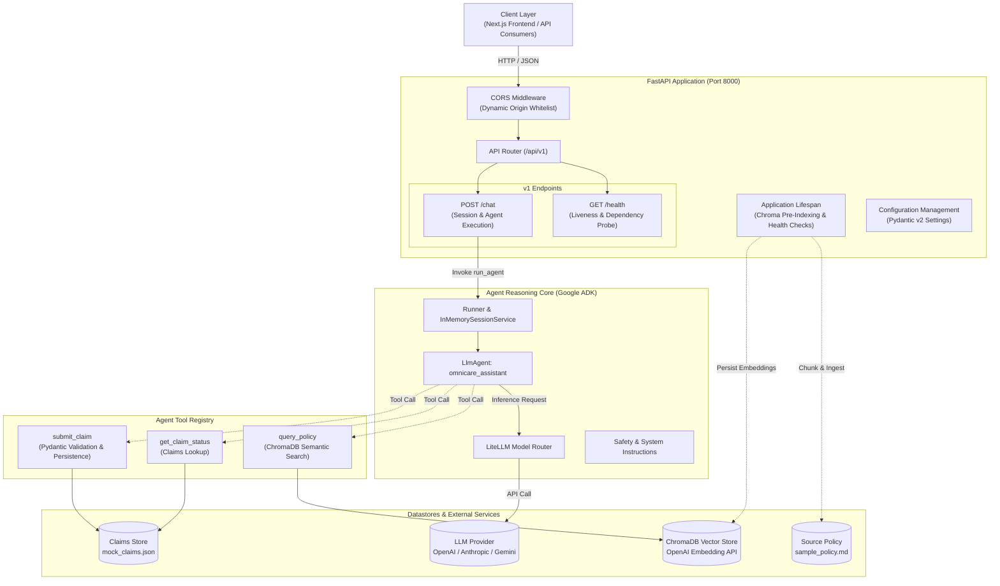
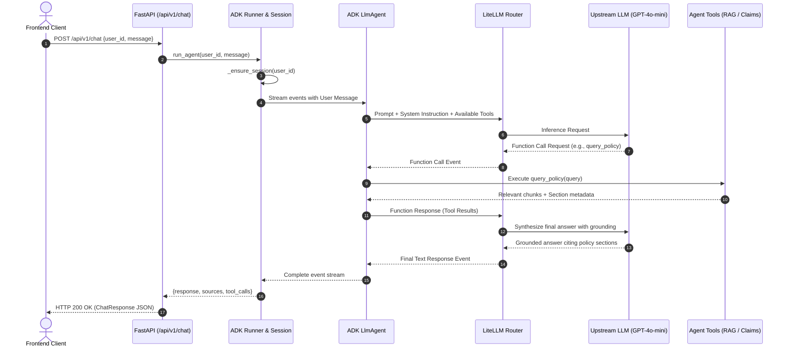

# OmniCare Financial -- Backend Engineering Guide & Technical Architecture

Welcome to the backend service of **OmniCare Financial**, an enterprise-grade AI customer service platform. The backend provides an intelligent conversational assistant capable of answering complex policy coverage inquiries via Retrieval-Augmented Generation (RAG), querying existing insurance claim statuses, and validating/filing new claims.

---

## 1. System Architecture Overview

The backend is built with Python 3.11+ using an asynchronous, modular architecture powered by **FastAPI**, **Google ADK (Agent Development Kit)**, **LiteLLM**, and **ChromaDB**.

### High-Level Architectural Layers



### Component Responsibilities

| Component                   | Path                                                                                                               | Responsibility                                                                                                                      |
| --------------------------- | ------------------------------------------------------------------------------------------------------------------ | ----------------------------------------------------------------------------------------------------------------------------------- |
| **Application Entrypoint**  | [`app/main.py`](file:///Users/eslamaboutaleb/Documents/omnicare-financial/backend/app/main.py)                     | Initializes FastAPI, mounts CORS middleware, executes startup RAG ingestion, and binds API routes.                                  |
| **Configuration Core**      | [`app/config.py`](file:///Users/eslamaboutaleb/Documents/omnicare-financial/backend/app/config.py)                 | Centralized, type-safe environment configuration powered by Pydantic v2 `SettingsConfigDict` and `@lru_cache` dependency injection. |
| **API Endpoints**           | [`app/api/v1/`](file:///Users/eslamaboutaleb/Documents/omnicare-financial/backend/app/api/v1)                      | Declares versioned HTTP endpoints (`/health`, `/chat`) with strict semantic status codes and OpenAPI schema documentation.          |
| **Data Schemas**            | [`app/schemas/models.py`](file:///Users/eslamaboutaleb/Documents/omnicare-financial/backend/app/schemas/models.py) | Pydantic request, response, error envelopes, and tool data models.                                                                  |
| **Agent Core**              | [`app/agent/agent.py`](file:///Users/eslamaboutaleb/Documents/omnicare-financial/backend/app/agent/agent.py)       | Sets up Google ADK `LlmAgent`, `Runner`, session handling, event streaming, and tool resolution.                                    |
| **System Prompts & Safety** | [`app/agent/prompts.py`](file:///Users/eslamaboutaleb/Documents/omnicare-financial/backend/app/agent/prompts.py)   | System instructions, tool usage rules, grounding requirements, and prompt-injection defense mechanisms.                             |
| **RAG Engine**              | [`app/rag/`](file:///Users/eslamaboutaleb/Documents/omnicare-financial/backend/app/rag)                            | Markdown document chunking (`ingest.py`), OpenAI embeddings (`OpenAIEmbeddingFunction`), and vector retrieval (`retriever.py`).        |
| **Agent Tools**             | [`app/agent/tools/`](file:///Users/eslamaboutaleb/Documents/omnicare-financial/backend/app/agent/tools)            | Domain functions executable by the agent: policy lookup, claim status retrieval, and validated claim filing.                        |

---

## 2. Request Lifecycle & Logic Flow

### 2.1 Chat Processing & Agent Tool Execution

When a user submits a query to `/api/v1/chat`, the system coordinates session recovery, LLM reasoning, iterative tool execution, and source attribution:



---

## 3. API Integrity & HTTP Status Code Matrix

The API strictly adheres to RESTful semantics and RFC 9110 standards. All responses return predictable, deterministic HTTP status codes:

### HTTP Status Code Reference

| Status Code                     | Description                 | Scenario / Trigger                                                                                                                                                                      |
| | ------------------------------- | --------------------------- | --------------------------------------------------------------------------------------------------------------------------------------------------------------------------------------- |
| **`200 OK`**                    | Request succeeded           | - `GET /api/v1/health`: System is healthy and datastores are reachable.<br/>- `POST /api/v1/chat`: Message processed successfully.                                                      |
| **`400 Bad Request`**           | Malformed HTTP request      | - Invalid JSON syntax in request body.<br/>- Unsupported headers or content types.                                                                                                      |
| **`405 Method Not Allowed`**    | Verb not permitted          | - `POST /api/v1/health`: Health endpoint only permits `GET`.                                                                                                                            |
| **`422 Unprocessable Content`** | Pydantic validation failure | - Missing `user_id` or `message` in `ChatRequest`.<br/>- Empty `user_id` (`min_length=1`).<br/>- Invalid types (e.g. non-string `user_id`).                                             |
| **`500 Internal Server Error`** | Uncaught server failure     | - Agent runner crash or unhandled runtime exceptions.<br/>- **Security**: In production (`ENVIRONMENT=production`), error messages are sanitized to prevent sensitive internal leakage. |
| **`503 Service Unavailable`**   | Infrastructure failure      | - `GET /api/v1/health`: Filesystem datastore or vector database is inaccessible or permissions fail.                                                                                    |

### Standardized Error Envelope

All error responses (including validation failures) use a consistent `ErrorResponse` schema:

```json
{
  "error": {
    "code": "VALIDATION_ERROR",
    "message": "Request validation failed. See details for field-level errors.",
    "details": [
      {
        "type": "missing",
        "loc": ["body", "user_id"],
        "msg": "Field required",
        "input": {"message": "Can I check my claim status?"}
      }
    ]
  }
}
```

This envelope is enforced globally via a `RequestValidationError` exception handler in `app/main.py`, ensuring the actual response schema always matches the OpenAPI declaration.

---

### Endpoint Reference

#### `GET /api/v1/health`

Evaluates application liveness and verifies datastore accessibility.

- **Status Codes**: `200 OK` (Healthy), `503 Service Unavailable` (Degraded)
- **Response Example**:
  ```json
  {
    "status": "healthy"
  }
  ```

#### `POST /api/v1/chat`

Processes conversational queries through the OmniCare agent.

- **Request Headers**: `Content-Type: application/json`
- **Request Body**:
  ```json
  {
    "user_id": "usr_1024",
    "message": "Is water damage from a burst pipe covered under my policy?"
  }
  ```
- **Response (`200 OK`)**:
  ```json
  {
    "response": "Yes, water damage caused by sudden and accidental pipe bursts is covered up to $25,000 under Section 1 with a $500 deductible.",
    "sources": ["Section 1: Home Water Damage Coverage (sample_policy.md)"],
    "tool_calls": [
      {
        "name": "query_policy",
        "arguments": {
          "query": "water damage burst pipe"
        },
        "result": {
          "sources": [
            {
              "section": "Section 1: Home Water Damage Coverage",
              "source": "sample_policy.md"
            }
          ]
        }
      }
    ]
  }
  ```
- **Error Response (`422 Unprocessable Content`)**:
  ```json
  {
    "error": {
      "code": "VALIDATION_ERROR",
      "message": "Request validation failed. See details for field-level errors.",
      "details": [
        {
          "type": "missing",
          "loc": ["body", "user_id"],
          "msg": "Field required",
          "input": {"message": "Can I check my claim status?"}
        }
      ]
    }
  }
  ```

---

## 4. Configuration Management

Configuration is strictly centralized in [`app/config.py`](file:///Users/eslamaboutaleb/Documents/omnicare-financial/backend/app/config.py) using **Pydantic v2 `BaseSettings`** and **`SettingsConfigDict`**. No raw `os.getenv` calls are permitted across application modules.

### Environment Variables Matrix

| Variable                 | Type        | Default Value                    | Validation / Format                                    | Description                                                   |
| ------------------------ | ----------- | -------------------------------- | ------------------------------------------------------ | ------------------------------------------------------------- |
| `ENVIRONMENT`            | `str`       | `development`                    | One of: `development`, `staging`, `production`, `test` | Runtime environment tier. Controls error detail sanitization. |
| `APP_NAME`               | `str`       | `OmniCare Financial API`         | Non-empty string                                       | Application title reflected in OpenAPI docs.                  |
| `APP_VERSION`            | `str`       | `1.0.0`                          | Semantic version string                                | Service version.                                              |
| `LOG_LEVEL`              | `str`       | `INFO`                           | `DEBUG`, `INFO`, `WARNING`, `ERROR`, `CRITICAL`        | Root logging level.                                           |
| `HOST`                   | `str`       | `0.0.0.0`                        | Valid IP / hostname                                    | Interface to bind Uvicorn.                                    |
| `PORT`                   | `int`       | `8000`                           | Integer `1` to `65535`                                 | Server TCP port.                                              |
| `CORS_ORIGINS`           | `list[str]` | `["http://localhost:3000", ...]` | Comma-separated string, JSON list, or list             | Whitelisted CORS origins for web clients.                     |
| `OPENAI_API_KEY`         | `str`       | `""`                             | Valid secret key string                                | OpenAI API key utilized by LiteLLM.                           |
| `OPENAI_API_BASE`        | `str`       | `""`                             | Valid URL or empty string                              | Optional OpenAI API base URL override for LiteLLM.            |
| `LLM_MODEL`              | `str`       | `openai/gpt-4o-mini`             | `provider/model_name` string                           | Model routed via LiteLLM.                                     |
| `CHROMA_DB_PATH`         | `str`       | `./app/data/chroma_db`           | Valid directory path                                   | Storage location for persistent vector database.              |
| `CHROMA_COLLECTION_NAME` | `str`       | `omnicare_policies`              | Alphanumeric string                                    | ChromaDB collection identifier.                               |
| `EMBEDDING_MODEL`        | `str`       | `text-embedding-3-small`          | Pretrained model identifier                            | OpenAI embedding model name used by ChromaDB.                 |
| `CLAIMS_FILE_PATH`       | `str`       | `./app/data/mock_claims.json`    | Valid file path                                        | Mock claims JSON storage path.                                |
| `POLICY_FILE_PATH`       | `str`       | `./app/data/sample_policy.md`    | Valid file path                                        | Source policy document for RAG ingestion.                     |

FastAPI endpoints consume settings through `Depends(get_settings)`:

```python
from fastapi import APIRouter, Depends
from app.config import Settings, get_settings

router = APIRouter()

@router.get("/example")
async def example_route(settings: Settings = Depends(get_settings)):
    return {"environment": settings.environment}
```

This enables seamless mock injection during unit and integration testing without monkeypatching environment variables.

---

## 5. Development & Testing Guide

### Prerequisites

- Python 3.11 or higher
- C/C++ compiler toolchain (for native Python package builds)
- (Optional) Docker & Docker Compose

### Local Environment Setup

1. **Navigate to the Backend Directory**:

   ```bash
   cd backend
   ```

2. **Create and Activate a Virtual Environment**:

   ```bash
   python3 -m venv .venv
   source .venv/bin/activate
   ```

3. **Install Dependencies**:

   ```bash
   pip install -r requirements.txt
   ```

4. **Configure Environment Variables**:

   ```bash
   cp ../.env.example .env
   # Add your OPENAI_API_KEY in .env
   ```

5. **Run the Policy Ingestion Pipeline** (Pre-computes embeddings):

   ```bash
   python -m app.rag.ingest
   ```

6. **Start the Uvicorn Development Server**:

   ```bash
   uvicorn app.main:app --reload --host 0.0.0.0 --port 8000
   ```

7. **Access Interactive API Documentation**:
   - Swagger UI: [http://localhost:8000/docs](http://localhost:8000/docs)
   - ReDoc: [http://localhost:8000/redoc](http://localhost:8000/redoc)

---

### Automated Testing

The backend includes a comprehensive test suite covering API endpoints, agent tools, configuration management, and RAG retrieval:

```bash
# Run all tests
pytest tests -v

# Run specific test modules
pytest tests/test_chat.py -v
pytest tests/test_config.py -v
pytest tests/test_health.py -v
pytest tests/test_rag.py -v
pytest tests/test_submit_claim.py -v
pytest tests/test_claim_status.py -v
```

#### Test Architecture & Isolation

- **Mock LLM Execution**: `test_chat.py` mocks `run_agent` to ensure tests execute offline, deterministically, and with zero external API costs.
- **Isolated Datastores**: `conftest.py` provides the `sample_claims_path` fixture which copies `mock_claims.json` into temporary directories per test, preventing cross-test data pollution.
- **In-Memory Chroma Fixture**: Retrieval tests utilize an isolated, temporary Chroma persistent directory.

---

## 6. Production Hardening & Security Standards

1. **Input Sanitization & Validation**:
   - All payloads are strictly validated using Pydantic models before touching agent reasoning or business logic.
   - String fields strip extraneous whitespace and enforce minimum length boundaries.

2. **Error Information Leakage Prevention**:
   - In production (`ENVIRONMENT=production`), unhandled 500 exceptions return generic, user-safe error messages while logging the complete traceback with context internally.

3. **Prompt Injection & Model Guardrails**:
   - The system prompt in [`app/agent/prompts.py`](file:///Users/eslamaboutaleb/Documents/omnicare-financial/backend/app/agent/prompts.py) defines strict role boundaries. Attempts to override instructions, role-play as administrator, or extract system instructions are explicitly detected and rejected.
   - Grounding rules require that all policy coverage answers cite retrieved sections directly from `query_policy`.

4. **Container Security**:
   - The [`Dockerfile`](file:///Users/eslamaboutaleb/Documents/omnicare-financial/backend/Dockerfile) builds upon `python:3.11-slim`, executes build-time RAG indexing, and exposes only the required port 8000.
